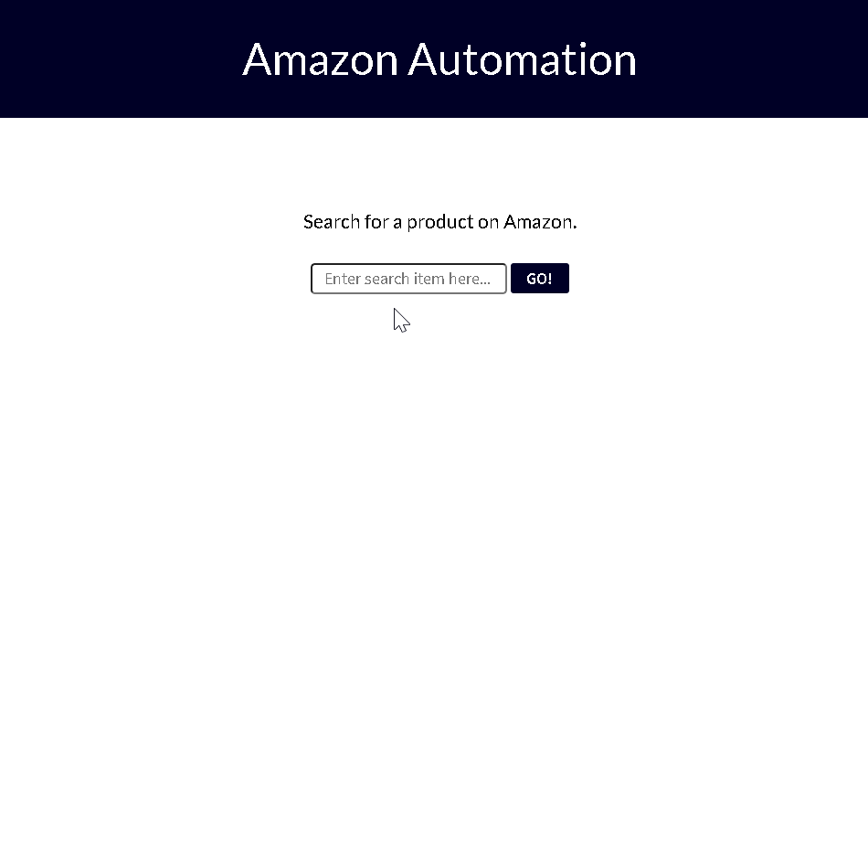

# Amazon Automation

A Django application which searches through the top rated 4-star-plus Amazon products and displays the results.

## Instructions

1. Enter the desired product

***Firstly, the program will open an instance of Amazon, then it will search for the product entered, after that it will select 4+ stars and from there the results will be displayed on screen.***

## Demo

[Amazon Automation](https://amazon-automation.herokuapp.com/)

## Technologies Used

Django, Selenium, Python, JavaScript, CSS3, HTML5

### CODE:
 [Django Views](https://github.com/DavidHuerta11/Amazon-Automation/blob/master/Search_App/views.py)
 [Selenium](https://github.com/DavidHuerta11/Amazon-Automation/blob/master/run_search.py)
 [HTML file](https://github.com/DavidHuerta11/Amazon-Automation/blob/master/Search_App/templates/index.html)
 [SCSS file](https://github.com/DavidHuerta11/Amazon-Automation/blob/master/Search_App/static/scss/style.scss)

## Problems faced
 
The main problem faced was with the JSON data provided by the Open Weather API. Some of the JSON data was not valid which caused errors within the database. The file was also too large which caused PostgreSQL out of memory errors.

